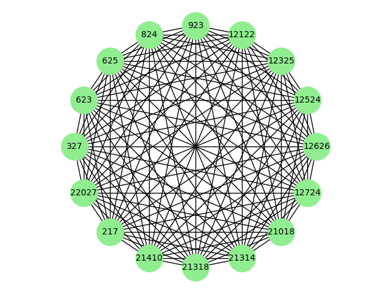

# Decentralized Systems Technologies
## Project for Decentralized Systems Technologies @ CEID 

The goal of the project was to implement a decentralized index based on distributed hashing and experimentally evaluate it with synthetic data sets or even real data sets in the following basic operations: Build, Insert key, Delete key, Update key, Lookup key, node join (insert node), node leave or failure (delete node), range queries, similarity queries.

### Chord DHT
 
### Pastry DHT
  
